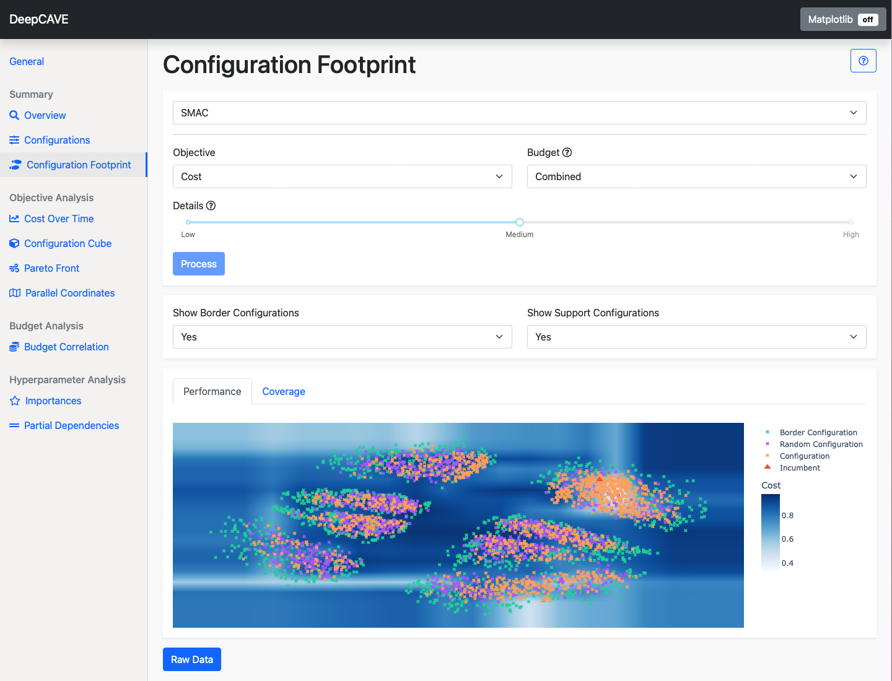

 

# DeepCAVE

DeepCAVE is a visualization and analysis tool for AutoML (especially for the sub-problem
hyperparameter optimization) runs. The framework is programmed on top of Dash and therefore
entirely interactive. Multiple and diverse plugins make it possible to efficiently generate insights
and bring the human back in the loop. Moreover, the powerful run interface and the modularized
plugin structure allow extending the tool at any time effortlessly.



Following features are provided:
- Interactive Dashboard (completely written in Python) to self-analyze optimization runs/processes.
- Analyzing while optimizing (run changes are automatically detected).
- A large collection of plugins to explore multiple areas like performance, hyperparameter and
budget analysis.
- Save your runs using DeepCAVE's native recorder.
- Support for many optimizers using converters (e.g., DeepCAVE, SMAC and BOHB).
- Select runs directly from a working directory in the interface.
- Select groups of runs for combined analysis.
- Modularized plugin structure with access to selected runs/groups to provide maximal flexibility.
- Asynchronous execution of expensive plugins and caching of their results.
- Help buttons and integrated documentation in the interface helps you to understand the plugins.
- Use the matplotlib mode to customize and save the plots for your publication.
- The API mode gives you full access to the code, while you do not have to interact with the 
interface. Otherwise, you can also make use of the raw data, provided by every plugin.


## Installation

First, make sure you have [redis-server](https://flaviocopes.com/redis-installation/) installed on
your computer.

Afterwards, follow the instructions to install DeepCAVE:
```bash
conda create -n DeepCAVE python=3.9
conda activate DeepCAVE
conda install -c anaconda swig
pip install DeepCAVE
```

If you want to contribute to DeepCAVE use the following steps instead:
```bash
git clone https://github.com/automl/DeepCAVE.git
cd DeepCAVE
conda create -n DeepCAVE python=3.9
conda activate DeepCAVE
conda install -c anaconda swig
make install-dev
```

If you want to use the given examples, run this after installing:
```bash
make install-examples
```

Please visit the [documentation](https://automl.github.io/DeepCAVE/main/installation.html) to get
further help (e.g. if you can not install redis server or you are on a mac).


## Recording

A minimal example is given to show the simplicity yet powerful API to record runs.
However, existing optimizers like BOHB, SMAC, Auto-Sklearn, Auto-PyTorch are supported natively.

```python
import ConfigSpace as CS
from deepcave import Recorder, Objective


configspace = CS.ConfigurationSpace(seed=0)
alpha = CS.hyperparameters.UniformFloatHyperparameter(
    name='alpha', lower=0, upper=1)
configspace.add_hyperparameter(alpha)

accuracy = Objective("accuracy", lower=0, upper=1, optimize="upper")
mse = Objective("mse", lower=0)

with Recorder(configspace, objectives=[accuracy, mse]) as r:
    for config in configspace.sample_configuration(100):
        for budget in [20, 40, 60]:
            r.start(config, budget)
            # Your code goes here
            r.end(costs=[0.5, 0.5])
```


## Visualizing and Evaluating

The webserver as well as the queue/workers can be started by simply running:
```bash
deepcave --open
```

If you specify `--open` your webbrowser automatically opens at `http://127.0.0.1:8050/`.
You can find more arguments and information (like using custom configurations) in the
[documentation](https://automl.github.io/DeepCAVE/main/getting_started.html).


## Example runs

DeepCAVE comes with some pre-evaluated runs to get a feel for what DeepCAVE can do.

When you installed the package from GitHub via `git clone git@github.com:automl/DeepCAVE.git; pip install -e DeepCAVE`,
you can try out some examples by exploring the `logs` directory inside the DeepCAVE dashboard.
For example, if you navigate to `logs/DeepCAVE`, you can view the run `mnist_pytorch` if you hit
the `+` button.


## Citation

If you use DeepCAVE in one of your research projects, please cite our [ReALML@ICML'22 workshop paper](https://arxiv.org/abs/2206.03493):
```
@misc{sass-realml2022,
    title = {DeepCAVE: An Interactive Analysis Tool for Automated Machine Learning},
    author = {Sass, René and Bergman, Eddie and Biedenkapp, André and Hutter, Frank and Lindauer, Marius},
    doi = {10.48550/ARXIV.2206.03493},
    url = {https://arxiv.org/abs/2206.03493},
    publisher = {arXiv},
    year = {2022},
    copyright = {arXiv.org perpetual, non-exclusive license}
}
```

Copyright (C) 2016-2022  [AutoML Group](http://www.automl.org/).