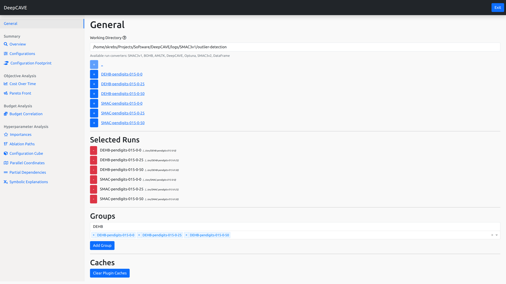

Getting Started
===============

After you have followed the installation steps, you can start DeepCAVE via following command
(in any directory):

.. code:: bash

    $ deepcave

Additionally, you have several other options:

.. code:: bash

    $ deepcave --open --n_workers=1 --config="path/to/your/local.py"

* **\-\-open**: Automatically opens the DeepCAVE GUI in the browser after the DeepCAVE server has been
  started.
* **\-\-n_workers**: Number of workers to use for the queue.
* **\-\-config**: Path to a configuration file if you want to use a custom configuration (like 
  changing ips, ports or refresh rate). The argument accepts both relative and absolute paths.
  However, make sure the path is enclosed in quotes.

.. warning::
    The configuration file must include a ``Config`` class which inherits from
    :ref:`Config<Config>`. Also, you should avoid to name the file ``config.py`` as this is
    reserved.

After hitting enter, you are automatically redirected to the interactive dashboard (if you
added `--open`).
In the dashboard, you will see the main page, in which you
can select the runs you want to analyze. Please have a look at the following image
to see the dashboard in action:

Displaying the data is done via plugins. You can select the plugins you want to use in the menu on the left.
This is further explained in the :ref:`plugins<Displaying Data with Plugins>` section.

DeepCAVE uses runs to interprete data. A run is a collection of trials
(a configuration with associated costs). Once valid runs (see :ref:`converter<Converters>`) are
found, you can select them to analyze them further. After selecting runs, you can also add them to
groups to analyze combined runs easily.
