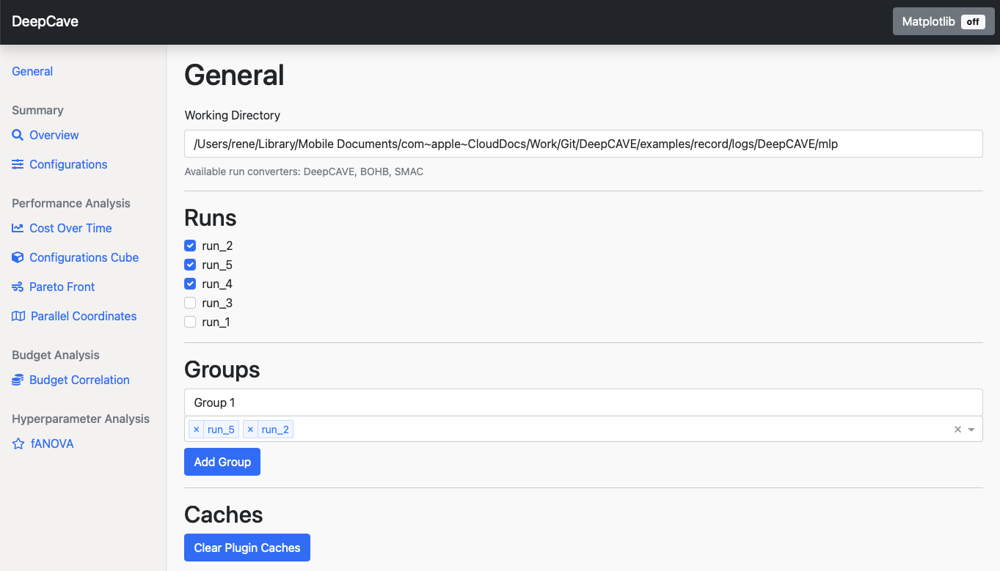

Getting Started
===============

After you have followed the installation steps, you can start DeepCAVE via following command:

.. code:: bash

    $ deepcave --start

You can start DeepCAVE with a specific configuration, which is in particular interest if you
need to change the ips and ports:

.. code:: bash

    $ deepcave --start --config=X

.. note::
    The configuration file is located in ``configs/X.py``. The file ``X.py`` must implement a
    :ref:`Config<Config>` class.

After hitting enter, you are automatically redirected to the interactive dashboard.
In the dashboard, you will see the main page, in which you
can select the runs you want to analyze. Please have a look at the following image
to see the dashboard in action:

 
DeepCAVE uses runs to interprete data. A run is a collection of trials (a configuration with associated costs).
Once valid runs (see :ref:`converter<Converters>`) are found, you can select them to analyze them further.
After selecting runs, you can also add them to groups to analyze combined runs easily.
