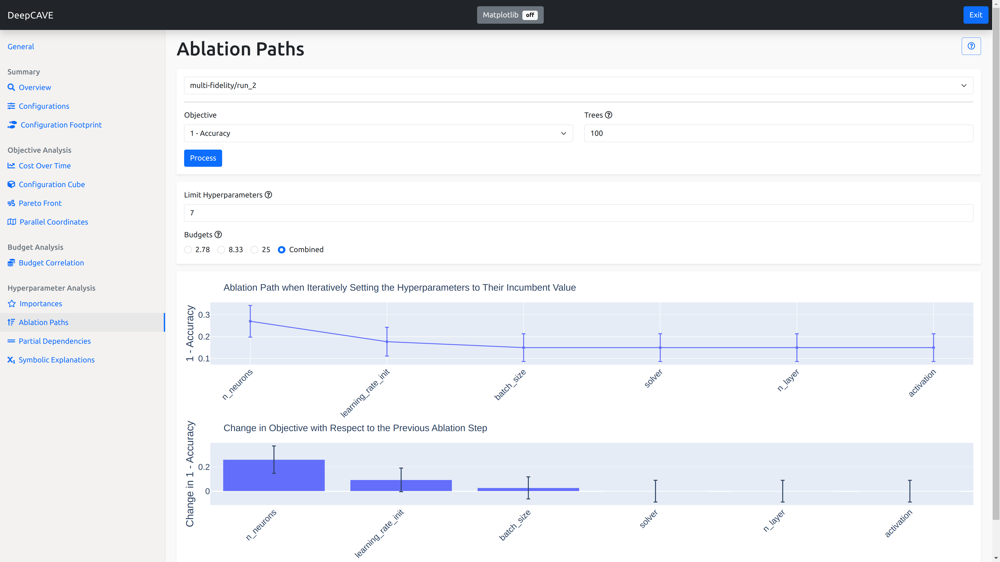

Ablation Paths
===========

Ablation Paths is a method to analyze the importance of hyperparameters in a configuration space.
Starting from a default configuration, the default configuration is iteratively changed to the
incumbent configuration by changing one hyperparameter at a time, choosing the
hyperparameter that leads to the largest improvement in the objective function at each step.

To learn more about Ablation Paths, please see the paper
`Efficient Parameter Importance Analysis via Ablation with Surrogates
<https://doi.org/10.1609/aaai.v31i1.10657>`_.

.. note::
    If a plot is not showing for a specific budget, you might have to evaluate more configurations
    from your configuration space in order to improve the performance of the surrogate model.
    You can also try to increase the number of trees for the surrogate model.

.. note::
    Please note the order the hyperparameters are in. The performance increase
    or decrease of each hyperparameter depends on the hyperparameter(s) prior to it.
    If the performance decreases no matter which hyperparameter is chosen next,
    the hyperparameter with the smallest decrease in performance is chosen.
    If two hyperparameters increase or decrease the performance equally, one is chosen randomly.