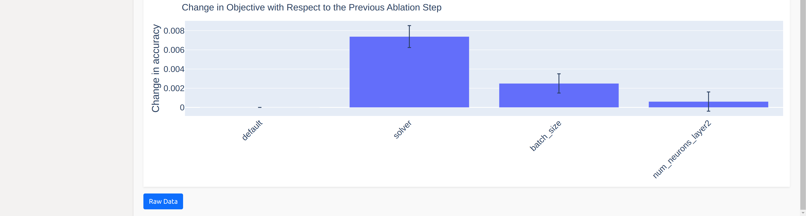

Ablation Paths
===========

Ablation Paths is a method to analyze the importance of hyperparameters in a configuration space.
Starting from a default configuration, the default configuration is iteratively changed to the
incumbent configuration by changing one hyperparameter at a time, choosing the
hyperparameter that leads to the largest improvement in the objective function at each step.

This plugin is capable of answering following questions:

* How does each hyperparameter impact the objective function when transitioning from the default to the incumbent configuration?
* Which hyperparameters lead to the most significant improvements in performance during the iterative optimization process?
* Are there specific hyperparameters that are consistently crucial for performance improvements, regardless of the budget?

To learn more about Ablation Paths, please see the paper
`Efficient Parameter Importance Analysis via Ablation with Surrogates
<https://doi.org/10.1609/aaai.v31i1.10657>`_.

.. image:: ../images/plugins/ablation_paths.png

Options
-------
* **Objective**: Select the objective function you wish to analyze.

* **Trees:** Specify the number of trees for the random forest surrogate model used in calculating importance scores.

To refine your analysis, you can apply filters after calculation:

* **Limit Hyperparameters**: Show only the top N most important hyperparameters.

* **Show Confidence**: Selection of whether to display confidence estimates based on the surrogate model's uncertainty estimates.

* **Budgets**: Filter the results to view importance scores specific to certain multi-fidelity budgets, allowing you to analyze how hyperparameter importance varies with budget changes.

.. note::
    If a plot is not showing for a specific budget, you might have to evaluate more configurations
    from your configuration space in order to improve the performance of the surrogate model.
    You can also try to increase the number of trees for the surrogate model.

.. note::
    Please note the order the hyperparameters are in. The performance increase
    or decrease of each hyperparameter depends on the hyperparameter(s) prior to it.
    If the performance decreases no matter which hyperparameter is chosen next,
    the hyperparameter with the smallest decrease in performance is chosen.
    If two hyperparameters increase or decrease the performance equally, one is chosen randomly.
