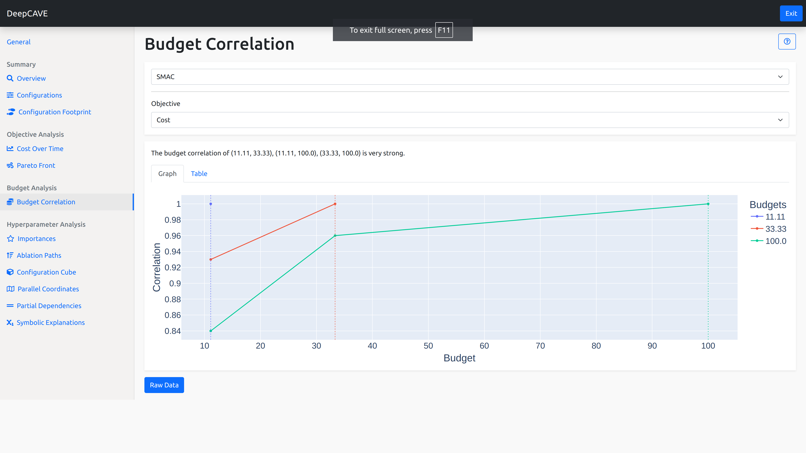

Budget Correlation
==================

When multiple budgets are used, it is not clear how representitive lower budgets are of the final
score if the same configuration was to be evaluated at a higher budget.
One such way to gain knowledge about this is to use *budget correlation*, such that if a low budget
correlates well with a higher budget, then we know that evaluating configurations at a lower budget
is *good enough* to infer about how they would perform at higher budgets. Conversly, if a low budget
does not correlate with higher budgets, we know that we would need to fully evaluate configurations
on high budgets to really be informed of how well they might perform.

For example, in Neural Networks, you do not need to train longer if convergence was already reached.
If the convergence already was reached in budget 1 but the training still continues till budget 2,
the correlation between budget 1 and budget 2 will be high.

This plugin is capable of answering following questions:

* Are low budget trials a fair representation of a configurations true performance if evaluated at
  a higher budget?
* Should I consider running further optimization with lower budgets, so that I can cover more of the
  configuration space?

Options
-------

**Objective**: Here you can select the objective you wish to analyze for.
The score for an objective will be communicated through the color of a point with an associated
heatmap.

Correlation Interpretation
--------------------------
The first thing to check is how the highest budget correlates with all the lower budgets.
You can sanity check that it perfectly correlates with itself, a value of 1 and then trace it back
to the previous budgets and see how it correlates to lower budgets.

You'll likely see that the highest budget correlates better with mid-range budgets and slowly drops
as you consider its correlation with lower and lower budgets.

There is no great answer to what a certain correlation will mean and this depends on what you would
like to do with this information and how much extra resources you have.
If you are trying to determine whether you could perform further runs with less budget, making the
process to find good configurations faster, you should make sure that the highest budget correlates
well with the lowest budget, achieving a correlation score of at least *0.7* or more.
This is rather an arbitrary number and your own context is important here. However, we provide
a list (which is incorporated in the dynamic generated text) how the correlations can be
interpreted:

* \>=0.70: Very strong relationship
* 0.40-0.69: Strong relationship
* 0.30-0.39: Moderate relationship
* 0.20-0.29: Weak relationship
* 0.01-0.19: No or negligible relationship

