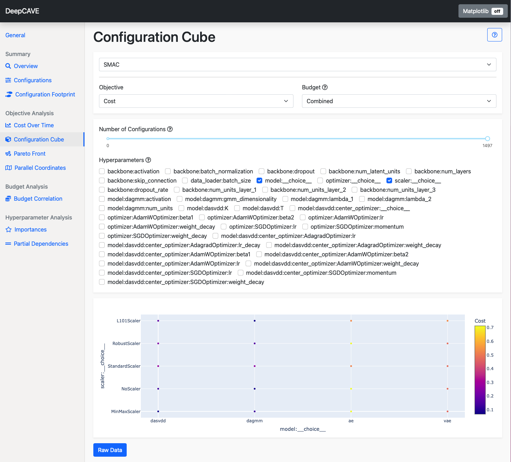

Configuration Cube
==================

The configuration cube displays configurations and their objective scores.
Naturally, the space of configurations may be very high dimensional and so this plugins allows you
to investigate the configurations through 2D or 3D *slices* of the configuration space,
plotting the values of hyperparameters as points in this *slice* of the space.

The Configuration Cube is helpful to visually inspect and answer the following questions:

* How does the influence of one hyperparameter on the objective score compare to others?
* Does the optimizer show a preference for specific values of hyperparameters over time?

Options
-------
* **Objective**: Select the objective function you wish to analyze. The objective scores will be
  represented using a color scale.

* **Budget**: Select the multi-fidelity budget to be used. The plugin will only consider trials evaluated
  on the selected budget. The *Combined* budget option displays all configurations but shows scores only
  from the highest budget if a configuration was evaluated with multiple budgets.

To refine your analysis, you can apply filters after calculation:

* **Number of Configurations**: This slider will allow you to select the number of configurations to
  display, where the configurations are ordered by they when they were trialed. Adjusting this slider
  helps to visualize how the optimizer's focus on hyperparameters has evolved over time.

* **Hyperparameters**: Choose the slice of the configuration space to visualize. Selecting:

    * **One hyperparameter** provides a basic 1D view, where configurations are plotted along a single axis.
    * **Two hyperparameters** generates a 2D grid view, showing configurations in a plane.
    * **Three hyperparameters** creates a 3D cube view, plotting configurations in three dimensions.
      In cases where multiple configurations map to the same point, the one with the highest score for the
      selected objective is displayed. This is particularly noticeable in the 1D view, where many configurations
      may share the same hyperparameter value.
