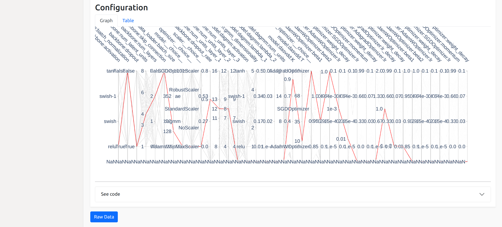

Configurations
==============

This plugin enables in-depth analysis of individual configurations. After selecting a run and
configuration ID, the information is presented in four sections:

* Overview
* Objectives
* Configuration
* Code

Since configurations are used throughout the application, you might find links that direct you
to the Configurations plugin in other plugins.

This plugin is capable of answering following questions:

* Where is the configuration coming from?
* How do the objective values vary with different budgets?
* What is the status of trials associated with the selected configuration?
* Which values have been used for a certain configuration?
* How can I access the configuration in Python?

.. image:: ../images/plugins/configurations.png

Overview
--------
The overview tells you more about the origin of the configuration. Especially if you are
viewing a group, it is important to know from which run and from which configuration ID the
selected configuration is coming from.

Objectives
----------
The objectives section visualizes how objective values vary across different budgets, allowing you
to assess how your metrics change as the budget increases.
The table view provides a detailed listing of objective values, along with explanations for why
certain budget and objective combinations might be missing (e.g., due to a crash or because they
were not evaluated).

Configuration
-------------
In the configuration section, you can view the final selected hyperparameters. The graph view offers
a visual summary, while the table provides detailed information on the specific values chosen.

Code
----
When a configuration is selected for deployment, it is essential to access it programmatically.
The code section provides you with the code necessary to retrieve the configuration, facilitating
its integration and use in your applications.
