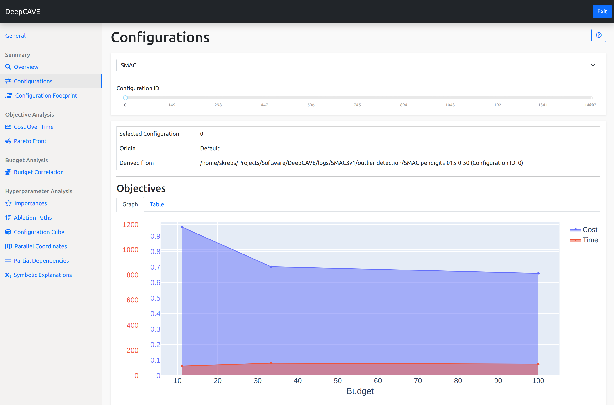

Configurations
==============

This plugin let's you analyze single configurations. After you select a run and a configuration id
you see the information listed in four parts:

* Overview
* Objectives
* Configuration
* Code

Since configurations are used throughout the application, you might find links associated to this
plugin. This plugin is capable of answering following questions:

* Where is the configuration coming from?
* How are the objective values wrt the budgets?
* How is the status of a trial associated with the selected configuration?
* Which values have been used for a certain configuration?
* How can I access the configuration in python?

Overview
--------
The overview tells you more about the origin of the configuration. Especially, if you are
viewing a group, it is important to know from which run and from which configuration id the
selected configuration is coming from.

Objectives
----------
The objective section, on the other hand, visualizes the objective values over the budgets. In here,
you can determine how your metrics change with increasing budget. Using the table view,
not only the objective values are listed but also why a specific combination of budget and objective
might not be available (e.g., because it crashed or it simply was not evaluated).

Configuration
-------------
In the configuration section, you see how the hyperparameters were selected in the end. While the
graph view gives you a nice overview, the table displays the concrete values.

Code
----
Often a configuration is selected for deployment, which makes it crucial to access it somehow.
The code block provides you the code to access the configuration code-wise. 

