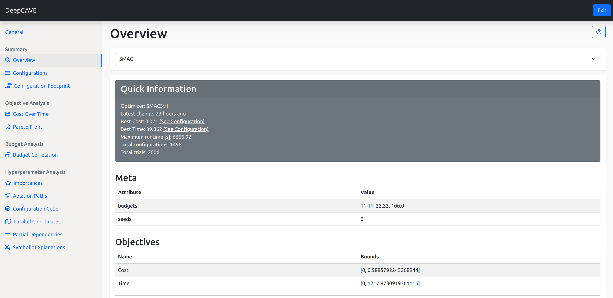

Overview
========

The plugin overview is a perfect way to see the most important information about
your selected runs. This plugin serves as sanity check and therefore let's you know
about the meta data, objectives and statistics of the selected run.

The Overview is split into 5 parts:

* Quick Information
* Meta
* Objectives
* Statuses
* Configuration Space

This plugin is capable of answering following questions:

* Which optimizer was used?
* When was the latest change of the optimizer's data?
* What is the best configuration?
* Are the meta data as expected?
* Are the objectives as expected?
* Is the configuration space as expected?
* How many trials have been successful/unsuccessful?
* Why did certain trials crash?
* On which multi-fidelity budgets were the configurations evaluated?

Quick Information
-----------------

In the **Quick Information** box you'll information regarding summary statistics about your run or
group of runs. Notably information on the optimizer used, how many configurations were tried, when
the runs were last updated and a handy quick link to the best **Configuration**.

Meta
----
Next we show some meta information regarding your runs. Notably, you can see information such as the
possible **budget** allocations that were considered during the run. The **budget** is the amount of
resources that were allocated to a configuration as it was being evaluated using a multi-fidelity
approach.

Objectives
----------
In this section, we see the objectives that were considered during the optimization run. Here we get
information about it's name and the bounds they were in.

Statuses
--------
To get a nice overview of the optimization run, we provide a barplot that details how the end status
of the many trials that occurred. You can also view these as a heatmap or get more information from
the **Details** tab.

The barplot shows which trial received which status and under which budget allocation. These are
grouped according to the status and coloured based on the status it exited with.

To see details on how these configurations faired as they progressed in budget, you can refer to
the **Heatmap** tab. Here you'll see the budget allocation along the x-axis with the configuration
ID stacked on the y-axis. In an ideal scenario, you would see mostly **Success** bars spanning
across the entire plot, with some **NOT_EVALUATED** lines indicating there is further configurations
to try. However if you faced many crashes at high budgets for example, you'll see **CRASHED** bars
from the highest budget onwards. In general, you can use this to understand how often your optimizer
balances out between low budget evaluations and full budget evaluations.

In the **Details** tab, you'll receive an overview of configurations that were not successful.
Here you'll get some brief information about the config id number, the budget it was evaluated under
and the status it received. If there is an associated error we can provide, such as when it received
the **CRASHED** status, we will display it in the error column.

Configuration Space
-------------------

Lastly you can find information on the configuration space that was being optimized over.
Here we provide information on it's name, the possible values that could be tried as well as the
default value and whether it was optimized on a log-scale vs a linear one.

