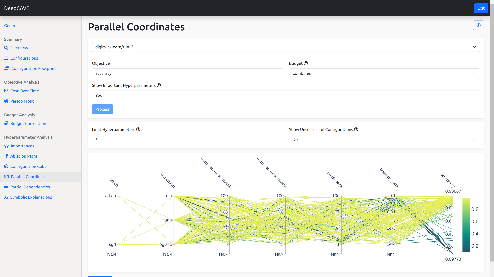

Parallel Coordinates
====================

With parallel coordinates, you can see configurations plotted as a line through their hyperparamter
values and to which final score they reach.
You can use this to identify trends in hyperparamter value ranges that achieve certain scores.
For example, you may find that high performing configurations may all share the same value for a
certain categorical hyperparamter, as indicated by many high scoring lines passing through this
value. These lines will be ordered according to their importance in determining the final score from
left to right with the default to show the top 10 important ones.
Lastly, you can place visual filters along these spines to really home-in on hyperparamters
important for your analysis.

This can help provide insight and answers to various questions:

* What hyperparamter values, or combinations of them, lead to a range of final scores?
* Which hyperparamter values does the optimizer tend to prefer?
* What hyperparamter configurations lead to crash configurations?

Options
-------

* **Objective**: Here you can select the objective you wish to analyze for.
  The score will be placed as the last bar along the x-axis along with incoming lines indication
  which configuration achieved what score.

* **Budget**: Here you can specify a filter for which budgets you wish to view.
  The *Combined* budget will show all configurations trialed but only show their scores on the
  highest budget if it was evaluated under multiple different budgets.

* **Show Important hyperparameters**: With this, you can limit the number of spines in the plot to
  just the top 10 most important hyperparamters, calculated using fANOVA with 5 trees.
  These will be arranged left to right according to their importance.
  You can select *No* and instead show **all** hyperparamters, selecting those you consider most
  important for you.

* **Show Unsuccessful Configurations**: By default, we do not crowd the plot with configurations that
  did not manage to complete but you may enable plotting them by changing this to *Yes*.
  This could be useful to identify hyperparamters or combinations of them that caused them to not
  complete.

Using the plot
--------------
The plot can be overwhelming at first but it is quite dynamic and easy to filter.

One of the most useful features to know is that you can draw a bar on a spine to add a visual filter
to all of the configuration lines.
Doing so on the objective, the right most spine, can help filter configurations that achieve a
certain score range. You can place as many of these as you like and clicking on them again to remove
them.

You can further re-arrange the spines by dragging their label above the spine left or right.
Doing so allows you to group together relevant hyperparamters and view configurations in a way that
makes sense for the question or problem at hand.

Sometimes, well-performing configurations tend to use similar hyperparameters.
This plugins let you analyze this behaviour in detail.

