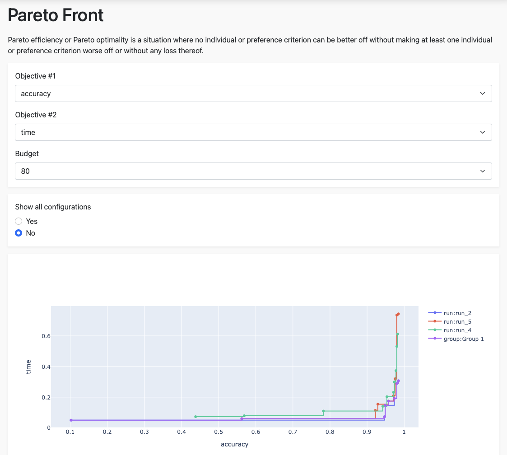

Pareto Front
============

Pareto efficiency, or Pareto optimality, occurs when no single configuration can be deemed superior
because multiple important objectives must be balanced. For instance, you might seek a configuration
that offers both high performance and low computational cost. The Pareto front helps by highlighting
the best configurations relative to two given objectives.

.. note::
    You can enable or disable specific runs if you click on the name right to the plot.
    Clicking on a configuration will redirect you to the configuration plugin, where you can
    view detailed information.

This plugin can help answer the following questions:

* Which configuration should I choose if I slightly favor objective A over objective B?
* How does optimizer A compare to optimizer B? Is optimizer A more effective than optimizer B?

