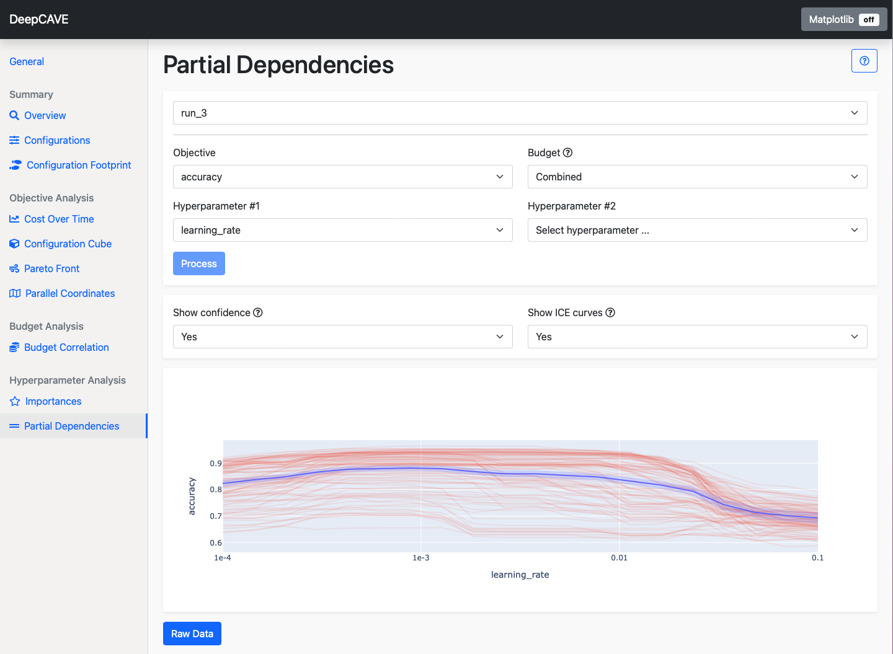

Partial Dependencies
====================

The quality of a machine learning algorithm is highly dependent on the choice of hyperparameters.
Partial dependence plots (PDP) aim to visualize how changing one or two hyperparameters affects the objective function.
The PDP is calculated using a random forest surrogate model trained on the run data, i.e. the evaluated hyperparameter configurations and corresponding objective values.

* In the **one hyperparameter case**, random samples or the selected hyperparameters are combined with each combination of the other hyperparameters present in the dataset, resulting in a multitude of individual conditional expectation (ICE) curves.
  The resulting ICE curves are than averaged to a PDP.
  The hyperparameter is plotted along the x axis, and the respective objective function value along the y-axis.

* The **two hyperparameter case** works as the one hyperparameter case, but the then two dimensional ICE-curves are disregarded in the plot.
  The resulting plot has one target hyperparameter plotted along the x-axis and the other hyperparameter plotted along the y-axis.
  The color in the heatmap plot indicates the respective objective function value.

This plugin is capable of answering the following questions:

* How does the objective change with respect to one or two hyperparameters? For example, does the
  accuracy increase if the learning rate decreases?
* What are the regions of the hyperparameter space that lead to better or worse performance?

Options
-------
* **Objective**: Select the objective function you wish to analyze. In the one hyperparameter case,
  the objective is plotted on the y-axis, in the two hyperparameter case, it is represented by the color.

* **Budget**: Select the multi-fidelity budget to be used. The plugin will only consider trials evaluated
  on the selected budget. The *Combined* budget option displays all configurations but shows scores only
  from the highest budget if a configuration was evaluated with multiple budgets.

* **Hyperparameter #1**: Select the first hyperparameter. It is plotted along the x-axis.

* **Hyperparameter #2**: Optionally select the second hyperparameter.

To refine your analysis, you can apply filters after calculation:

* **Show Confidence**: Selection of whether to display confidence estimates based on the surrogate
  model's uncertainty estimates.

* **Show ICE Curves**: Selection for whether to to show the ICE curves used during computation
  (only for the one hyperparameter case).
