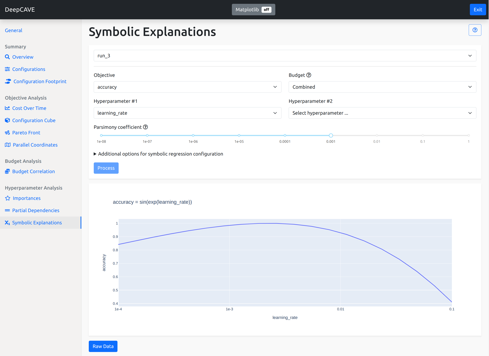

Symbolic Explanations
====================

Symbolic Explanations allow to obtain explicit formulas quantifying the relation between
hyperparameter values and model performance by applying symbolic regression to meta-data collected
during hyperparameter optimization.

The plugin is capable of answering similar questions as the Partial Dependencies plugin, i.e.:

* How does the objective change with respect to one or two hyperparameters? For example, does the
  accuracy increase if the learning rate decreases?
* Do multiple trials show similar behavior?

While the Partial Dependencies plugin provides a plot describing the effects of hyperparameters on
the model performance, the Symbolic Explanations plugin additionally allows to obtain an explicit
formula capturing these effects.

To learn more about Symbolic Explanations, please see the paper
`Symbolic Explanations for Hyperparameter Optimization
<https://openreview.net/forum?id=JQwAc91sg_x>`_.
