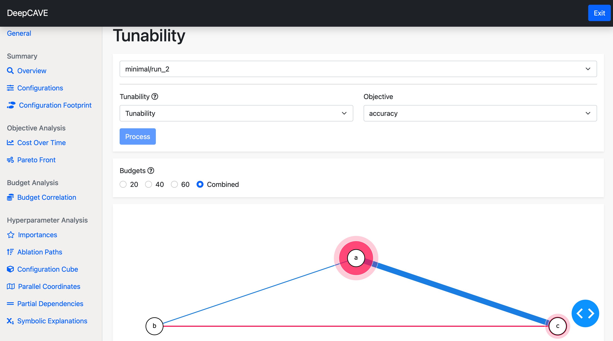

Tunability and Mistunability (HyperSHAP)
========================================

Tunability and Mistunability are methods to analyze the optimization potential and sensitivity of hyperparameters using HyperSHAP, a game-theoretic framework based on Shapley values 
and interactions. 
Rather than evaluating a single sequential path, these methods calculate the fair performance contribution of each hyperparameter across all possible combinations.
**Tunability** quantifies how much performance can be gained by tuning individual hyperparameters (or subsets) starting from a sampled baseline. 
Conversely, **Mistunability** quantifies how much performance can be lost due to mistuning a hyperparameter, highlighting the risks of poor configuration choices.

This plugin is capable of answering following questions:

* Which hyperparameters, when tuned, lead to the greatest expected improvement in the objective function?
* Which hyperparameters are highly sensitive and cause the most significant performance degradation if mistuned?
* Are there specific interactions between hyperparameters that consistently drive performance gains or losses, regardless of the budget?

To learn more about the underlying game-theoretic framework, please see the paper
`HyperSHAP: Shapley Values and Interactions for Explaining Hyperparameter Optimization
<https://arxiv.org/abs/2502.01276>`_.

Options
-------
* **Objective**: Choose the objective you wish to calculate the HyperSHAP values for.

* **Tunability Mode**: Choose between *Tunability* (to evaluate potential performance gains) and *Mistunability* (to evaluate potential performance losses).

* **Budgets**: Filter the results to view tunability/mistunability scores specific to certain multi-fidelity budgets, allowing you to analyze how hyperparameter importance varies with budget changes.

